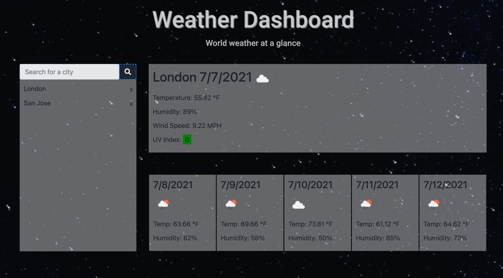
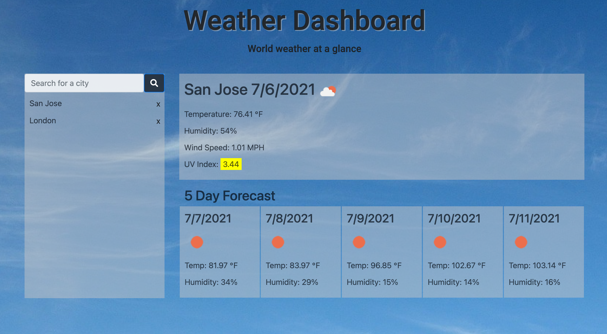
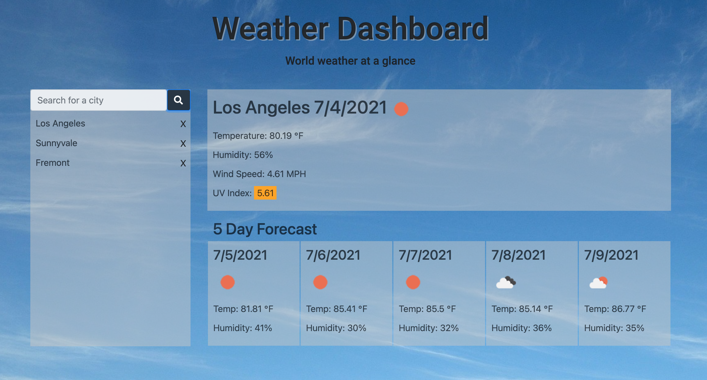

# Weather Dashboard
This project is to create a weather dashboard. The current weather and 5-day forecast weather data would be displayed when user search for a city.
## Getting Started
```console
git clone https://github.com/qtian13/Weather-Dashboard.git
```
## Built With
* [HTML](https://developer.mozilla.org/en-US/docs/Web/HTML)
* [CSS](https://developer.mozilla.org/en-US/docs/Web/CSS)
* [Bootstrap](https://stackpath.bootstrapcdn.com/bootstrap/4.3.1/css/bootstrap.min.css)
* [JavaScript](https://www.javascript.com/)
* [jQuery](https://cdnjs.cloudflare.com/ajax/libs/jquery/3.2.1/jquery.min.js)

## Description of the Weather Dashboard
1. There are 3 main parts in the page: a jumbotron header, a search section and the weather dashboard.
2. The search section includes a search bar and search history:
    * When user enter a certain city name and click search button, the weather data of this city would be loaded on the page if it exists. If the data is not found, `(Not Found)` is followed by the city name and no data is displayed on the dashboard. The most recently searched city name is listed at the top of search history.
    * The city names entered would be stored in the `Local Storage` and listed in the search history area. When user refreshes the page, search history persists and the most updated weather data of the city searched most recently would be displayed on the dashboard.
    * User can click any city in the search history to load the updated weather data of it. And the city would be at the top of search history as most recently searched. The search history item changes background color when a mouse hover over it.
    * The search history is hidden when the page displayed in the window of width < 992px. It appear when user click the input area and disappear when user click any history term or click any part except the search bar.
3. The weather data displayed on the dashboard includes current data and 5-day forecast:
    * The city name and current date is displayed at the top followed by detailed weather information.
    * The date is the local time of the city searched for. The weather data includes weather indicated by an icon image, temperature in unit Fahrenheit (°F), humidity, wind speed in unit MPH and UV index with background color indicating the severity.  
    * The dashboard also displayed date, daily weather(indicated by an icon image), temperature in unit Fahrenheit (°F) and humidity of the next 5 days for that city.
    * The timezone data and weather data are provided by [OpenWeather](https://openweathermap.org/).
    * The UV index color code refers to [Wikipedia](https://en.wikipedia.org/wiki/Ultraviolet_index).
4. The background image and the font color in the header changes according to the current time of the city. If it is between sunrise and sunset, the background image is daytime sky. Otherwise is night sky.


5. The page layout is screen size responsive.

## Page URL
https://qtian13.github.io/Weather-Dashboard/

## Page Demo
Demo for screen size >= 992 px


Demo for screen size less than 992px


## Page Screen Shot with Different Screen Width



## Author
Qiushuang Tian
- [Link to Portfolio Site](https://qtian13.github.io/)
- [Link to Github](https://github.com/qtian13)
- [Link to LinkedIn](https://www.linkedin.com/in/qiushuang-tian-a9754248/)

## Acknowledgments
- [Berkeley Coding Boot Camp](https://bootcamp.berkeley.edu/coding/) provided mock up image
- [OpenWeather](https://openweathermap.org/) provided timezone data and weather data
- [Wikipedia](https://en.wikipedia.org/wiki/Ultraviolet_index) provided color code of UV index number